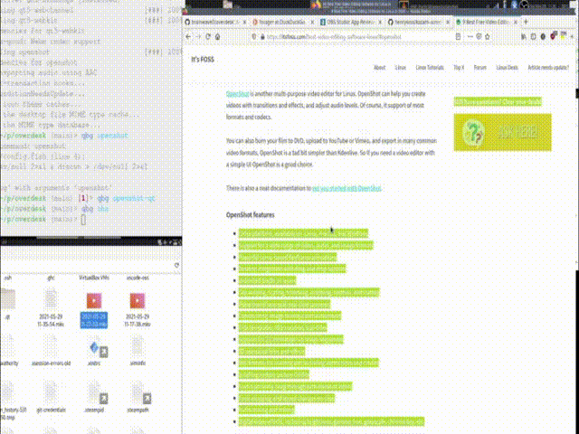

# OverDesk

An [oversized desktop](https://en.wikipedia.org/wiki/Virtual_desktop#Oversized_Desktops) implementation. It simulates a larger screen resolution by panning around a virtual desktop when the user moves the mouse cursor. Instead of relying on something like xrandr, OverDesk actually moves the windows around the desktop to achieve the panning effect. The panning method is inspired by the game [Forager](https://store.steampowered.com/app/751780/Forager/) (a pretty cool game by the way, you should check it out). As the mouse cursor moves, the windows move in the opposite direction until the cursor hits the edge of the screen.

## Requirements

### Operating System

Currently only GNU/Linux is supported. I have only tested it on Arch Linux.

### Software

- A window manager. I have tested it on Xfce and Awesome.

- Python 3

### Python packages

- xcffib

- ewmh

- pynput

## Usage

`$ main.py <horizontal resolution> <vertical resolution>`

Currently you can reposition windows only by dragging the titlebars.

## Questions, Comments, Issues, Contributing

Feel free to create an issue or pull request.
